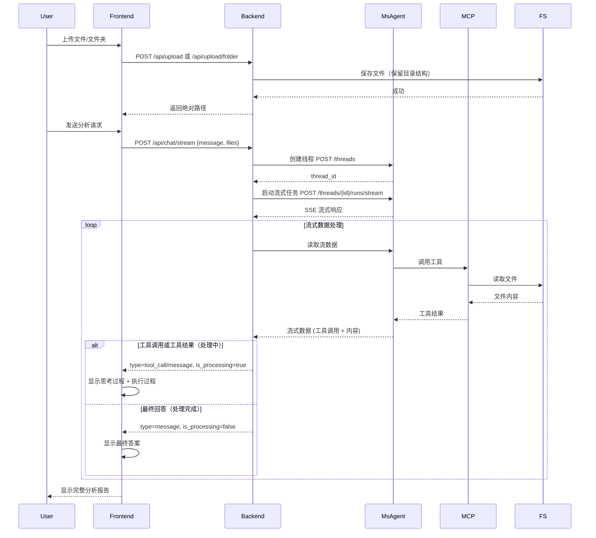

# msagent 性能分析平台 - 技术设计文档

## 1. 概述

### 1.1 项目背景

本项目旨在构建一个基于 msagent 的智能性能分析平台，通过 Web 界面提供性能数据文件上传和智能分析功能。平台集成了 msagent 的 MCP（Model Context Protocol）工具，能够自动分析性能数据文件并生成专业的分析报告。

### 1.2 技术目标

- 提供友好的 Web 界面，支持文件上传和聊天交互
- 集成 msagent 作为 AI 引擎，调用 MCP 工具进行数据分析
- 实现前后端分离，通过 API 进行通信
- 支持常见性能数据格式（CSV、JSON 等）的分析
- 实现流式输出，提升用户体验
- 支持思考过程显示，增强用户理解
- 支持文件夹上传，保留目录结构

### 1.3 架构风格

采用经典的三层架构模式：

- **表示层**: 前端 HTML + JavaScript
- **业务逻辑层**: Flask 后端服务
- **数据/AI层**: msagent + MCP 工具

______________________________________________________________________

## 2. 架构设计

### 2.1 整体架构

```
┌─────────────────────────────────────────────────────────────────────┐
│                     前端应用                                        │
│  ┌─────────────────────────────────────────────────────────────┐   │
│  │  Hermes 性能调优平台前端                                    │   │
│  │  - 文件上传模块                                             │   │
│  │  - 智能对话模块                                             │   │
│  │  - 分析结果展示                                             │   │
│  │  - 思考过程展示                                             │   │
│  │  - 内容分类渲染                                             │   │
│  └─────────────────────────────────────────────────────────────┘   │
└─────────────────────────────────┬───────────────────────────────────┘
                                  │ HTTP REST API
                                  ▼
┌─────────────────────────────────────────────────────────────────────┐
│                         Flask 后端服务                            │
│  ┌─────────────────────────────────────────────────────────────┐   │
│  │  - API 路由层                                              │   │
│  │  - 文件处理层                                              │   │
│  │  - msagent 代理层                                          │   │
│  │  - 流式数据处理层                                          │   │
│  │  - 消息分类层                                              │   │
│  │  - 会话管理层                                              │   │
│  └─────────────────────────────────────────────────────────────┘   │
└─────────────────────────────────┬───────────────────────────────────┘
                                  │ HTTP REST API
                                  ▼
┌─────────────────────────────────────────────────────────────────────┐
│                       msagent web 服务                           │
│  ┌─────────────────────────────────────────────────────────────┐   │
│  │  - LangGraph API Server                                    │   │
│  │  - Hermes Agent                                            │   │
│  │  - MCP 工具调用                                             │   │
│  │  - LLM 集成                                                 │   │
│  └─────────────────────────────────────────────────────────────┘   │
└─────────────────────────────────┬───────────────────────────────────┘
                                  │ API
                                  ▼
┌─────────────────────────────────────────────────────────────────────┐
│                          大模型服务                               │
│  - GLM-4.7 (或 Qwen2.5-7B-Instruct)                            │
│  - 华为或其他兼容的大模型服务                                     │
└─────────────────────────────────────────────────────────────────────┘
```

### 2.2 模块职责

| 模块 | 职责 | 说明 |
|------|------|------|
| 前端页面 | 用户交互界面 | 提供文件上传、聊天对话、结果展示、思考过程 |
| Flask 后端 | 服务代理层 | API 路由、文件处理、msagent 代理、流式数据处理、消息分类 |
| msagent web | 核心业务层 | Agent 执行、工具调用、LLM 交互 |
| MCP 工具 | 数据分析层 | 性能数据解析、分析、查询 |
| 大模型服务 | AI 推理 | 提供自然语言理解和生成能力 |

### 2.3 数据流



______________________________________________________________________

## 3. 接口设计

### 3.1 后端 API 接口

#### 3.1.1 健康检查

| 属性 | 值 |
|------|-----|
| **路径** | `/health` |
| **方法** | `GET` |
| **描述** | 检查服务健康状态 |

**响应：**

```json
{
    "status": "healthy",
    "service": "flask-backend"
}
```

#### 3.1.2 聊天接口（非流式）

| 属性 | 值 |
|------|-----|
| **路径** | `/api/chat` |
| **方法** | `POST` |
| **描述** | 发送消息到 msagent，返回响应 |

**请求体：**

```json
{
    "message": "分析这个文件",
    "files": ["D:\\work\\uploads\\op_summary.csv"]
}
```

**响应：**

```json
{
    "response": "文件包含 128 行数据，共 46 列..."
}
```

#### 3.1.3 文件上传

| 属性 | 值 |
|------|-----|
| **路径** | `/api/upload` |
| **方法** | `POST` |
| **描述** | 上传性能数据文件 |

**请求体：**

```
Content-Type: multipart/form-data
file: <文件二进制数据>
```

**响应：**

```json
{
    "filepath": "D:\\work\\uploads\\op_summary.csv",
    "filename": "op_summary.csv"
}
```

#### 3.1.4 文件夹上传接口

| 属性 | 值 |
|------|-----|
| **路径** | `/api/upload/folder` |
| **方法** | `POST` |
| **描述** | 上传整个文件夹，保留文件夹结构 |

**请求体（multipart/form-data）：**

| 参数 | 类型 | 说明 |
|------|------|------|
| `folder_name` | string | 文件夹名称 |
| `files[]` | file | 文件列表 |
| `relative_paths[]` | string | 相对路径列表 |

**响应：**

```json
{
    "folder_path": "D:\\uploads\\abc12345",
    "files": ["D:\\uploads\\abc12345\\file1.csv", "D:\\uploads\\abc12345\\subdir\\file2.json"],
    "count": 2
}
```

#### 3.1.5 分析接口

| 属性 | 值 |
|------|-----|
| **路径** | `/api/analyze` |
| **方法** | `POST` |
| **描述** | 分析性能数据文件 |

**请求体：**

```json
{
    "files": ["file1.csv", "file2.json"]
}
```

**响应：**

```json
{
    "response": "分析结果..."
}
```

#### 3.1.6 流式聊天接口

| 属性 | 值 |
|------|-----|
| **路径** | `/api/chat/stream` |
| **方法** | `POST` |
| **描述** | 流式聊天接口，支持 SSE 流式输出 |
| **Content-Type** | `text/event-stream` |

**请求体：**

```json
{
    "message": "分析这个文件",
    "files": ["D:\\work\\uploads\\op_summary.csv"]
}
```

**响应头：**

```
X-Request-ID: <uuid>  # 用于后续停止请求的唯一标识
```

**响应（SSE 流式）：**

```
data: {"type": "tool_call", "tool_info": {"tool_name": "msprof-get-csv-info", "count": 1}, "thinking": "正在调用工具: msprof-get-csv-info...", "is_processing": true, "session_id": "<uuid>"}

data: {"type": "message", "content": "{工具执行结果...}", "tool_info": null, "is_processing": true, "session_id": "<uuid>"}

data: {"type": "message", "content": "最终回答内容", "tool_info": null, "is_processing": false, "session_id": "<uuid>"}
```

#### 3.1.7 停止聊天接口

| 属性 | 值 |
|------|-----|
| **路径** | `/api/chat/stop` |
| **方法** | `POST` |
| **描述** | 停止正在执行的聊天任务 |

**请求体：**

```json
{
    "request_id": "<uuid>"
}
```

**响应：**

```json
{
    "success": true,
    "message": "任务已停止"
}
```

### 3.2 msagent API 接口

#### 3.2.1 创建线程

```
POST /threads
```

**响应：**

```json
{
    "thread_id": "string"
}
```

#### 3.2.2 启动任务

```
POST /threads/{thread_id}/runs
Content-Type: application/json

{
    "assistant_id": "msagent",
    "input": {
        "messages": [
            {"role": "user", "content": "string"}
        ]
    }
}
```

**响应：**

```json
{
    "run_id": "string"
}
```

#### 3.2.3 启动流式任务

```
POST /threads/{thread_id}/runs/stream
Content-Type: application/json

{
    "assistant_id": "msagent",
    "input": {
        "messages": [
            {"role": "user", "content": "string"}
        ]
    },
    "stream_mode": ["messages", "updates"]
}
```

**响应：** SSE 流式数据

#### 3.2.4 查询任务状态

```
GET /threads/{thread_id}/runs/{run_id}
```

**响应：**

```json
{
    "status": "completed",
    "thread_id": "thread-xxx",
    "run_id": "run-xxx"
}
```

______________________________________________________________________

## 4. 数据模型

### 4.1 消息结构

```json
{
  "type": "ai",
  "content": "字符串内容",
  "tool_calls": [
    {
      "name": "工具名称",
      "arguments": {
        "参数名": "参数值"
      }
    }
  ]
}
```

| 字段 | 类型 | 说明 |
|------|------|------|
| type | string | 消息类型：`ai` 或 `user` |
| content | string | 消息内容 |
| tool_calls | array | 工具调用列表 |

### 4.2 文件上传响应

```json
{
  "filepath": "D:\\work\\uploads\\file.csv",
  "filename": "file.csv"
}
```

### 4.3 聊天响应

```json
{
  "response": "分析结果文本"
}
```

### 4.4 流式响应数据结构

```json
{
  "type": "tool_call|message|error",
  "content": "消息内容",
  "tool_info": {
    "tool_name": "工具名称",
    "count": 1
  },
  "thinking": "思考过程描述",
  "is_processing": true|false,
  "session_id": "会话ID"
}
```

**is_processing 字段说明：**

| 值 | 含义 | 显示位置 |
|-----|------|----------|
| `true` | 工具调用中或工具结果 | 思考过程区域（执行过程滚动窗口） |
| `false` | 最终回答 | 最终答案区域 |

______________________________________________________________________

## 5. 部署方案

### 5.1 本地开发环境

```bash
# 1. 设置环境变量（敏感信息通过环境变量传递）
set OPENAI_API_KEY=<your-api-key>
set OPENAI_API_BASE=<your-api-base-url>

# 2. 启动 msagent web
msagent web

# 3. 启动 Flask 后端
cd msagent-integration/backend
python backend.py

# 4. 前端页面（Flask 直接提供静态文件）
# 访问：http://127.0.0.1:8082/agent-platform.html
```

### 5.2 流式输出配置

流式输出基于 SSE (Server-Sent Events) 技术实现：

#### 后端实现

- 使用 Flask 流式响应 `Response(generate(), mimetype='text/event-stream')`
- 调用 msagent 的 `/runs/stream` 端点获取流式数据
- 将 msagent 的流式响应转换为结构化 SSE 格式转发给前端
- 实现 Unicode 转义字符的解码处理
- **关键改进**：添加 `tool_in_progress` 状态追踪，区分工具调用结果和最终回答

#### 前端实现

- 使用 `fetch` API 的 `response.body.getReader()` 读取流
- 使用 `TextDecoder` 解码流数据
- 实时解析 JSON 格式的响应内容并更新 UI
- 支持思考过程的折叠/展开交互（**默认展开**）
- 每个工具调用创建独立的消息块
- 工具执行结果显示在带「📋 执行过程」标题的滚动窗口中

#### 关键配置

```python
# 后端 SSE 响应头
response.headers['Cache-Control'] = 'no-cache'
response.headers['X-Accel-Buffering'] = 'no'
response.headers['Access-Control-Allow-Origin'] = '*'
```

### 5.3 生产环境部署

#### 5.3.1 使用 Gunicorn 部署 Flask

```bash
pip install gunicorn
gunicorn -w 4 -b 0.0.0.0:8082 backend:app
```

#### 5.3.2 使用 Nginx 反向代理

```nginx
server {
    listen 80;
    server_name your-domain.com;

    location / {
        proxy_pass http://127.0.0.1:8082;
        proxy_set_header Host $host;
        proxy_set_header X-Real-IP $remote_addr;
    }

    location /api/ {
        proxy_pass http://127.0.0.1:8082/api/;
        proxy_set_header Host $host;
        proxy_set_header X-Real-IP $remote_addr;
        # SSE 相关配置
        proxy_buffering off;
        proxy_cache off;
        proxy_set_header Connection '';
        proxy_http_version 1.1;
        chunked_transfer_encoding off;
    }
}
```

### 5.4 服务端口配置

| 服务 | 端口 | 配置位置 |
|------|------|----------|
| msagent | 2025 | msagent web 默认 |
| Flask 后端 | 8082 | `backend.py` |

______________________________________________________________________

## 6. 安全考虑

### 6.1 认证机制

- API Key 通过环境变量传递（**不要硬编码到代码中**）
- 建议生产环境使用 OAuth 2.0
- 添加请求频率限制

### 6.2 文件上传安全

- 限制文件大小（500MB）
- 限制文件类型（仅允许 CSV、JSON、DB 等）
- 文件存储路径隔离（使用短 UUID 命名）
- 防止路径遍历攻击

### 6.3 CORS 配置

```python
def add_cors_headers(response):
    response.headers['Access-Control-Allow-Origin'] = '*'
    response.headers['Access-Control-Allow-Methods'] = 'GET, POST, OPTIONS, DELETE, PUT'
    response.headers['Access-Control-Allow-Headers'] = 'Content-Type, X-Session-ID, x-session-id, X-Requested-With, Accept, Origin, Authorization'
    response.headers['Access-Control-Allow-Credentials'] = 'true'
    response.headers['Access-Control-Max-Age'] = '3600'
    return response
```

### 6.4 代码安全性

- ✅ 不要将 API Key 硬编码到代码中
- ✅ 使用环境变量管理敏感配置
- ✅ 对用户输入进行验证和清理
- ✅ 防止路径遍历攻击
- ✅ 使用 HTTPS 传输敏感数据（生产环境）

______________________________________________________________________

## 7. 监控与日志

### 7.1 日志记录

```python
import logging

logging.basicConfig(
    level=logging.DEBUG,
    format='%(asctime)s - %(levelname)s - %(message)s'
)
```

### 7.2 监控指标

- API 调用次数
- 响应时间
- 错误率
- 模型调用次数
- 流式输出响应时间
- SSE 连接数
- 工具调用次数

______________________________________________________________________

## 8. 故障排查

### 8.1 常见问题

| 问题 | 原因 | 解决方案 |
|------|------|----------|
| 前端无法连接后端 | CORS 配置问题 | 检查 Flask 后端 CORS 配置 |
| msagent 连接失败 | OPENAI_API_KEY 未设置 | 设置环境变量 |
| 文件上传失败 | 文件大小限制或权限问题 | 检查上传目录权限 |
| 响应超时 | 网络问题或 msagent 响应慢 | 增加超时时间 |
| 消息重复显示 | 消息获取逻辑问题 | 从最后一条消息中获取结果 |
| 流式输出不显示 | JSON 解析失败 | 添加错误处理和备用解析逻辑 |
| Unicode 显示乱码 | 编码问题 | 添加双重编码解码处理 |
| 思考过程无法点击 | 事件冒泡问题 | 添加 e.stopPropagation() |
| 内容被覆盖 | 消息容器复用问题 | 每次创建新的消息容器 |
| 最终回答不显示 | 消息分类错误 | 更新到 v2.3+，检查 tool_in_progress 状态 |
| 工具结果显示异常 | tool_in_progress 状态问题 | 更新到 v2.3+ |

### 8.2 日志位置

- Flask 日志：控制台输出
- msagent 日志：控制台输出
- 建议生产环境配置日志文件

### 8.3 服务状态检查

```bash
# 检查 msagent web 服务状态
curl http://127.0.0.1:2025/health

# 检查 Flask 后端状态
curl http://127.0.0.1:8082/health

# 检查前端页面
curl http://127.0.0.1:8082/agent-platform.html
```

______________________________________________________________________

## 9. 扩展设计

### 9.1 已实现功能

| 功能 | 版本 | 状态 |
|------|------|------|
| 流式输出 | v1.1 | ✅ 已实现 |
| 上下文记忆 | v1.2 | ✅ 已实现 |
| 思考过程显示 | v1.3 | ✅ 已实现 |
| 折叠/展开 | v1.4 | ✅ 已实现 |
| Unicode 修复 | v1.5 | ✅ 已实现 |
| 分步显示 | v1.6 | ✅ 已实现 |
| 工具解析优化 | v1.7 | ✅ 已实现 |
| 打字机效果 | v1.8 | ✅ 已实现 |
| 文件夹上传 | v2.0 | ✅ 已实现 |
| 消息分类优化 | v2.3 | ✅ 已实现 |

### 9.2 未来扩展点

1. **消息历史**: 保存对话历史到数据库
1. **数据可视化**: 集成图表展示分析结果
1. **权限管理**: 添加用户认证和授权
1. **性能监控**: 添加详细的性能指标监控

### 9.3 MCP 工具扩展

平台可扩展支持更多 MCP 工具：

| 工具名 | 功能描述 |
|--------|----------|
| msprof-analyze-advisor | 综合性能分析 |
| msprof-execute-sql-query | SQL 查询 |
| msprof-find-slices | 切片搜索 |
| msprof-get-operator-details | 算子详情 |
| msprof-get-op-type-details | 算子类型统计 |
| msprof-analyze-overlap | Overlap 分析 |
| ls | 目录列表 |
| read_file | 文件读取 |

______________________________________________________________________

## 10. 技术迭代历史

### 10.1 v1.0 - 基础版本

- 基础的前后端分离架构
- 文件上传功能
- 简单的聊天交互
- 轮询方式获取 msagent 响应

### 10.2 v1.1 - 流式输出实现

- 使用 msagent 的 `/runs/stream` 端点
- 后端实现流式数据转发
- 前端使用 `response.body.getReader()` 读取流
- 添加 try-catch 错误处理

### 10.3 v1.2 - 上下文记忆功能

- 后端维护全局 `current_thread_id`
- 每次请求复用同一个线程
- 添加线程有效性检查

### 10.4 v1.3 - 思考过程显示

- 后端解析 tool_calls 信息
- 区分工具调用和消息类型
- 前端分层展示思考过程和最终答案

### 10.5 v1.4 - 折叠/展开功能

- 添加点击事件监听
- 使用 CSS class 控制显示/隐藏
- 添加动画效果

### 10.6 v1.5 - Unicode 编码修复

- 识别 Unicode 转义序列
- 使用 `encode('latin-1').decode('unicode_escape')` 解码
- 二次处理确保正确解码

### 10.7 v1.6 - 内容覆盖问题修复

- 每个工具调用创建新的消息块
- 不再复用消息容器
- 维护当前步骤状态

### 10.8 v1.7 - 工具名称解析优化

- 遍历 tool_calls 数组
- 支持多种数据结构：`function.name` 和 `tool_name`
- 使用 `last_tool_name` 去重

### 10.9 v1.8 - 流式输出优化

- 追踪内容长度变化
- 实现增量更新显示
- 添加打字机效果

### 10.10 v2.0 - 文件夹上传功能

- 使用 HTML5 `webkitdirectory` 属性
- 保留目录结构
- 使用短 UUID 避免 Windows 路径长度限制

### 10.11 v2.3 - 消息分类优化（**最新**）

- 添加 `tool_in_progress` 状态追踪
- 正确区分工具调用开始、工具执行结果、最终回答
- 工具结果显示在执行过程区域（`is_processing=true`）
- 最终回答显示在最终答案区域（`is_processing=false`）
- 思考过程默认展开

______________________________________________________________________

## 附录

### A. 配置文件

#### backend.py 关键配置

```python
MSAGENT_API_URL = 'http://127.0.0.1:2025'
UPLOAD_FOLDER = 'uploads'
PORT = 8082
SESSION_TIMEOUT = 30 * 60  # 30分钟
```

### B. 目录结构

```
msagent-integration/
├── backend/
│   └── backend.py
├── frontend/
│   └── agent-platform.html
├── docs/
│   └── TECHNICAL_DESIGN.md
└── README.md
```

### C. 支持的 MCP 工具清单

| 工具名 | 功能描述 |
|--------|----------|
| msprof-get-csv-info | 获取 CSV 文件基本信息 |
| msprof-execute-sql-query | 执行 SQL 查询 |
| msprof-analyze-advisor | 综合性能分析 |
| msprof-find-slices | 在 trace_view.json 中搜索切片 |
| msprof-get-operator-details | 获取算子详细信息 |
| msprof-get-op-type-details | 获取算子类型统计 |
| msprof-analyze-overlap | 分析 Overlap 过程 |
| ls | 列出目录文件 |
| read_file | 读取文件内容 |

### D. 关键技术点汇总

#### D.1 流式输出技术栈

- **协议**: SSE (Server-Sent Events)
- **后端**: Flask `Response(generator)`
- **前端**: `fetch` + `ReadableStream` + `TextDecoder`

#### D.2 Unicode 处理

- **问题**: UTF-8 字节被转义为 Unicode 序列
- **方案**: `encode('latin-1').decode('unicode_escape').encode('latin-1').decode('utf-8')`

#### D.3 消息分类算法

- **核心逻辑**: 使用 `tool_in_progress` 状态追踪
- **规则**:
  1. 检测到 `tool_calls` → `is_processing=true`, `tool_in_progress=true`
  1. 无 `tool_calls` 但 `tool_in_progress=true` → `is_processing=true`（工具结果）
  1. 无 `tool_calls` 且 `tool_in_progress=false` → `is_processing=false`（最终回答）

#### D.4 思考过程显示

- **默认状态**: 展开
- **交互**: 点击折叠/展开
- **布局**: 卡片式，每个工具调用独立块
- **执行过程**: 带标题的滚动窗口（高度限制）

______________________________________________________________________

## 更新日志

| 日期 | 版本 | 变更内容 |
|------|------|----------|
| 2026-05-11 | **v2.3** | **消息分类优化**：修复工具调用结果和最终回答的分类问题，添加 `tool_in_progress` 状态追踪，思考过程默认展开 |
| 2026-05-11 | v2.2 | **思考过程默认展开**：用户可实时看到工具调用和执行过程 |
| 2026-05-11 | v2.1 | **流式输出修复**：修复 LangGraph 流式格式解析，实现真正的流式输出打字机效果 |
| 2026-05-10 | v2.0 | **文件夹上传**：实现文件夹上传功能，支持 webkitdirectory，保留文件夹结构，使用短 UUID 避免路径过长 |
| 2026-05-10 | v1.9 | **停止机制**：实现真正的停止机制，添加任务管理和超时处理 |
| 2026-05-09 | v1.8 | **流式输出优化**：修复重复回答问题，实现增量内容更新和打字机效果 |
| 2026-05-09 | v1.7 | **工具名称解析优化**：支持多种数据格式，添加去重机制 |
| 2026-05-08 | v1.6 | **分步显示**：修复内容覆盖问题，实现分步显示 |
| 2026-05-08 | v1.5 | **Unicode 修复**：修复 Unicode 编码问题 |
| 2026-05-08 | v1.4 | **折叠功能**：添加思考过程折叠/展开功能 |
| 2026-05-07 | v1.3 | **思考过程显示**：实现思考过程显示 |
| 2026-05-07 | v1.2 | **上下文记忆**：添加上下文记忆功能 |
| 2026-05-07 | v1.1 | **流式输出**：实现 SSE 流式输出 |
| 2026-05-07 | v1.0 | **初始版本**：基础功能实现 |
